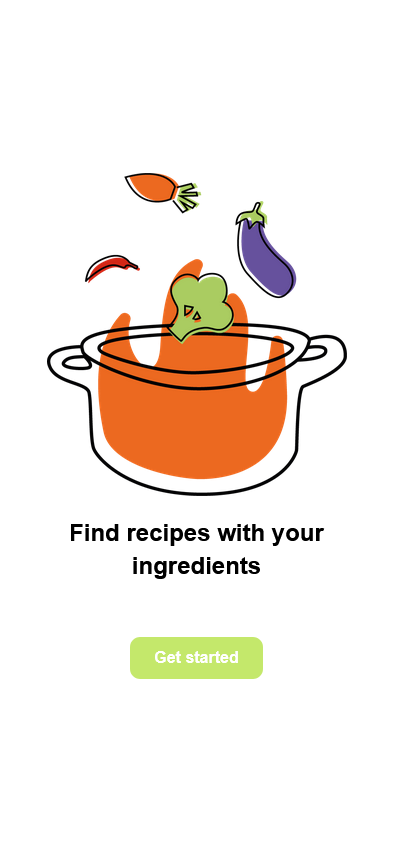
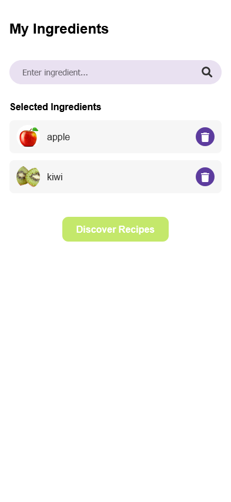
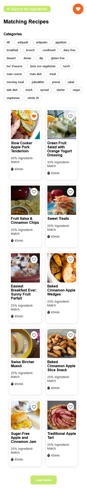
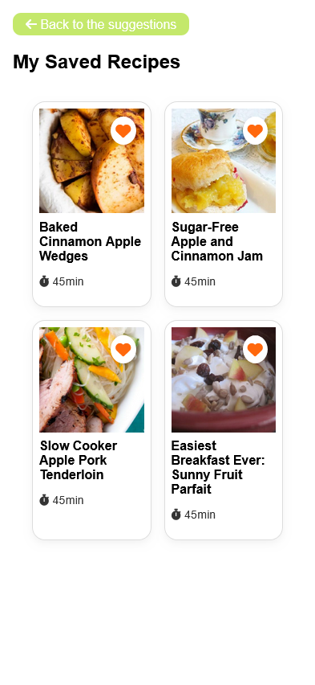

# What’s Cookin’? – Recipe Suggestion PWA

What’s Cookin’? is a Progressive Web App that helps users find suitable recipes based on ingredients they already have at home. The app was developed as part of the course 'Mobile Web Apps' during my Bachelor’s degree in Communication, Knowledge & Media at University of Applied Sciences Upper Austria, Campus Hagenberg.

## About the Project

Many people have ingredients at home but do not know what to cook with them. What’s Cookin’? addresses this problem by allowing users to enter available ingredients and receive recipe suggestions based on them.

The application uses the Spoonacular API to fetch recipe data and displays recipes based on how well they match the entered ingredients. Users can also save favorite recipes locally and access them later.

## Features

- Ingredient input via text field
- Recipe suggestions based on available ingredients
- Ingredient match display in percent
- Recipe detail view with cooking time, ingredients and instructions
- Local storage of saved recipes with IndexedDB
- Offline availability for saved recipes
- Progressive Web App support

## Tech Stack

### Frontend

- HTML
- CSS
- JavaScript

### API

- Spoonacular API for recipe suggestions and ingredients

### PWA Technologies

- Service Worker
- Web App Manifest
- Cache API
- IndexedDB

## Repository Structure

```text
index.html                  Home page with logo and entry point

pages/                      HTML pages for ingredient input, recipe suggestions,
                            recipe details and saved recipes

js/                         JavaScript files for API configuration, ingredient handling,
                            recipe search, recipe details, saving recipes with IndexedDB
                            and Service Worker registration

styles/                     CSS files for layout and responsive design

img/                        Images and visual assets

sw.js                       Service Worker for caching and offline functionality
manifest.webmanifest        PWA configuration
```

## My Contribution

This project was developed together with Emily Huber as part of the university course 'Mobile Web Apps'.

My work included concept development, frontend implementation, UI structure, API integration, recipe display logic, PWA functionality and documentation. The project was developed collaboratively, and both team members were involved in understanding and presenting the overall implementation.

## Screenshots

### Home



### Ingredient Input



### Recipe Suggestions



### Recipe Detail


### Saved Recipes



## Live Demo

A live demo is currently hosted on a university subdomain:

[Open Live Demo](https://whats-cookin.s2310456005.student.kwmhgb.at/)

Please note that the university hosting may only be available until the completion of my degree in 2026. Screenshots are therefore included in this repository as a permanent project documentation.

The app uses the free version of the Spoonacular API. Therefore, recipe suggestions may be temporarily unavailable if the daily request limit has been reached.

## Local Setup

For local development and testing, a local server should be used because Service Workers do not work reliably when opening files directly from the file system.

### 1. Clone the repository

```bash
git clone https://github.com/Johanna299/WhatsCookin.git
cd WhatsCookin
```

### 2. Configure the API key

The app uses the Spoonacular API to fetch recipe suggestions.

This project uses the free version of the Spoonacular API. Please note that the number of available API requests is limited. If the daily request limit is reached, recipe suggestions may temporarily not be available.

For security reasons, the actual API configuration file is not included in this repository. The file `js/api-config.js` is ignored by Git and must be created locally.

Create a local copy of the example configuration file:

```bash
cp js/api-config.example.js js/api-config.js
```

On Windows, you can also copy `js/api-config.example.js` manually and rename the copy to `api-config.js`.

Then open the new file:

```text
js/api-config.js
```

and replace the placeholder with your own Spoonacular API key:

```js
const SPOONACULAR_API_KEY = "YOUR_API_KEY_HERE";
```

### 3. Start a local server

You can open the project with WebStorm or PhpStorm and start it using the built-in local server.

Then open the local URL in your browser.

## Testing the PWA

To test the PWA behavior on a mobile device:

1. Open the live demo or local server URL in Chrome.
2. Open the browser menu.
3. Select “Add to Home Screen”.
4. Launch the app from the home screen.
5. Save a recipe and test whether it remains available offline.

## Project Context

This application was created for educational purposes as part of the course 'Mobile Web Apps'. The assignment focused on developing a small mobile web application with a meaningful use case, good user experience, an external API and PWA functionality.

## Authors

- Johanna Hofer
- Emily Huber

This project is non-commercial and was created as part of a university course.
